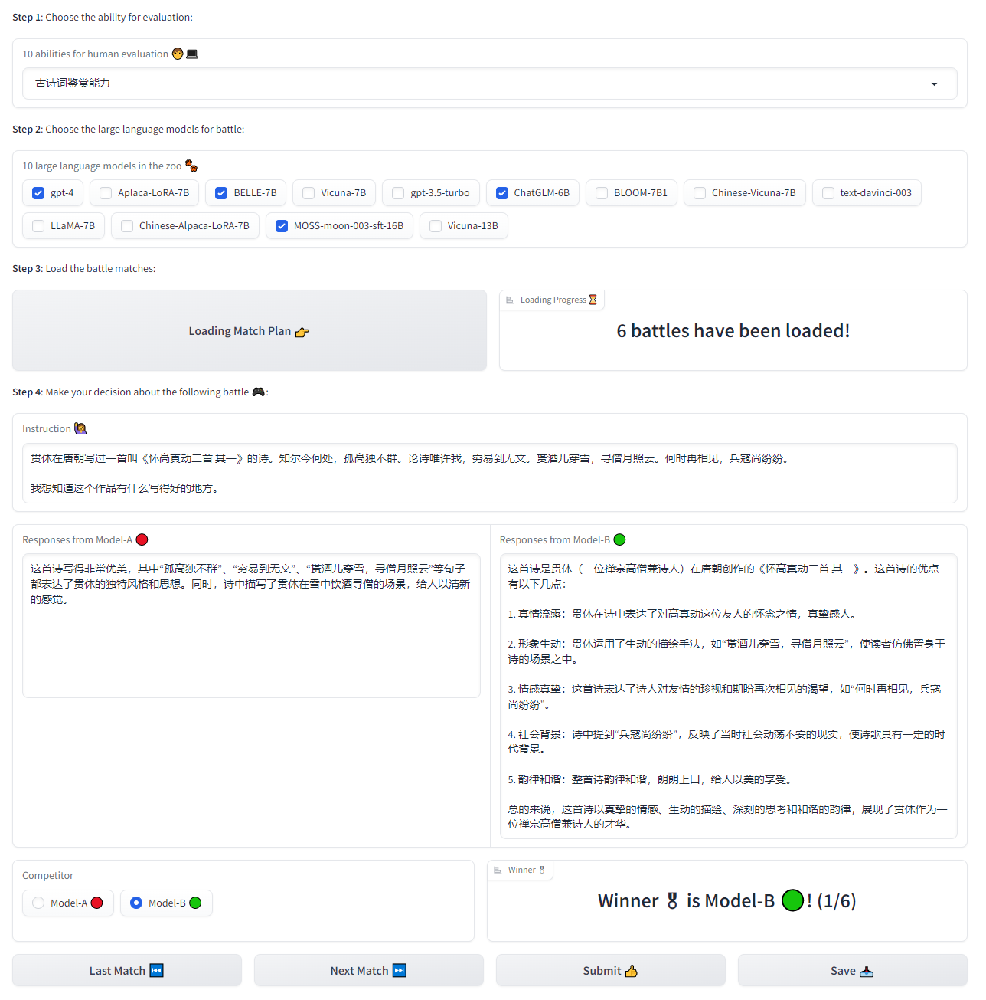

<h1 align="center"> 👽ALIEN: Ability Leading Evaluation </h1>

## 🚀LLM Deploy 
-------
### Deploy the large language model:
```shell
python api.py server --api=T5API --version=default --wrapper=Flask
```

### Complete human evaluation tasks with the deployed large language model apis:
```shell
python api.py client --model_name davinci --batch_size 2 --max_length 1024
```

### Simulate as the human evaluation server:
```shell
python api.py simulator --model_name davinci --simulate_task empathy --port 6566
```

## 📈Result Analysis 
-------
### Sample annotating data for TrueSkill strategy:
```shell
python analysis.py sampling \
 --name trueskill_evaluation \
 --match_plan 'alpaca&belle' 'alpaca&bloom' \
 --sample_num 3 \
 --evaluation_tasks 'empathy' \
 --dump_recovery_path resource/annotated/trueskill_recovery \
 --annotating_path resource/annotated/trueskill
```

### Recover annotated data for TrueSkill strategy:
```shell
python analysis.py recovery \
 --name trueskill_evaluation \
 --recovery_tasks 'empathy' \
 --annotated_data_path resource/annotated/trueskill \
 --recovery_info_path resource/annotated/trueskill_recovery \
 --dump_result_path resource/annotated/analysis_data
```

### Plot analysis figures:
```shell
python analysis.py plot \
 --type gaussian \
 --data_file resource/annotated_data/trueskill \
 --save_fig_path resource/figures/gaussian \
 --save_fig_name gaussian
```

## 🌐WebUI 
-------
### Arena mode:
```shell
python webui.py arena --port 8888
```


### Chat mode:
```shell
python webui.py chat --url http://10.140.24.23:7407/generate
```
