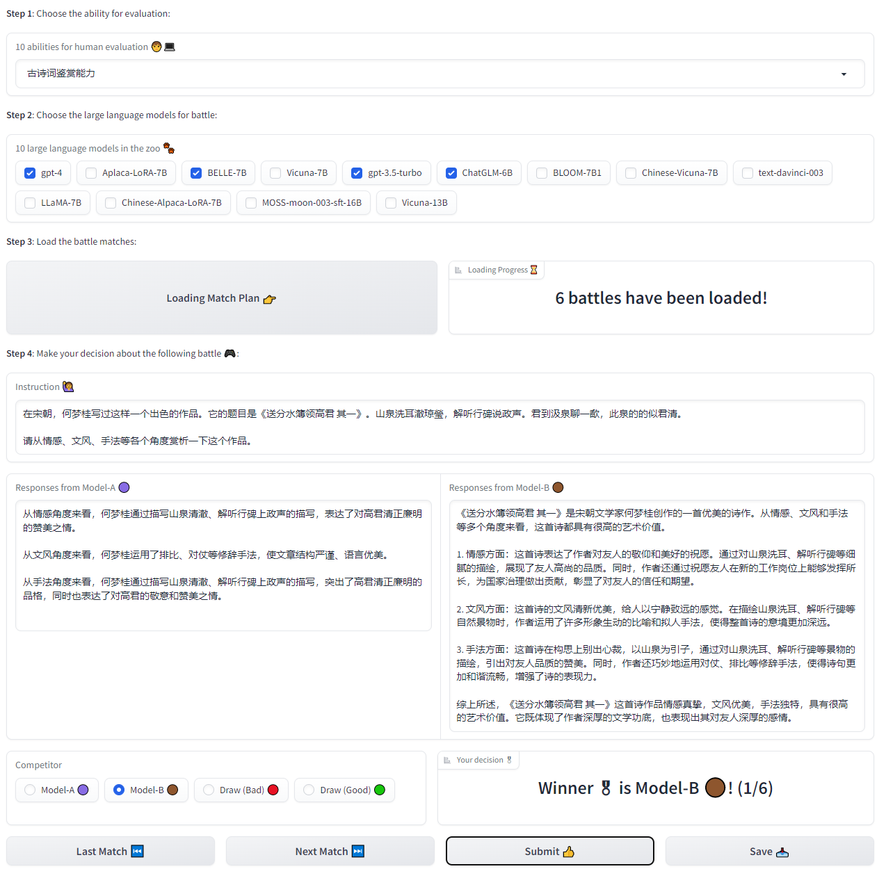

## Inference process with API server, API client and API simulator

### Deploy the large language model:

#### Choice 1: single task submission
```
python api.py server \
 --api=T5API \
 --wrapper=Flask
```

#### Choice 2: asynchronous task submission
```
sh server_deploy.sh --num_server 16
```

### Complete human evaluation tasks with the deployed large language model apis:
```
python api.py client \
 --model_name davinci \
 --batch_size 2 \
 --max_length 1024
```

### Simulate as the human evaluation server:
```
python api.py simulator \
 --model_name davinci \
 --simulate_task empathy \
 --port 6566
```

## Analysis process with annotated results

### Sample annotating data for TrueSkill strategy:
```
python analysis.py sampling \
 --name trueskill_evaluation \
 --match_plan 'alpaca&belle' 'alpaca&bloom' \
 --single_sample_size 3 \
 --evaluation_tasks 'empathy' \
 --dump_recovery_path copywriting/annotated/trueskill_recovery \
 --annotating_path copywriting/annotated/trueskill
```

### Recover annotated data for TrueSkill strategy:
```
python analysis.py recovery \
 --name trueskill_evaluation \
 --recovery_tasks 'empathy' \
 --annotated_path copywriting/annotated/trueskill_recovery \
 --annotating_path copywriting/annotated/trueskill \
 --dump_result_path copywriting/annotated/analysis_data
```

### Plot figures:
```
python analysis.py plot \
 --type gaussian \
 --data_file copywriting/annotated_data/trueskill \
 --save_fig_path plots/figures/gaussian \
 --save_fig_name gaussian
```

## WebUI for collecting human feedback infomation
```
python webui.py
```
